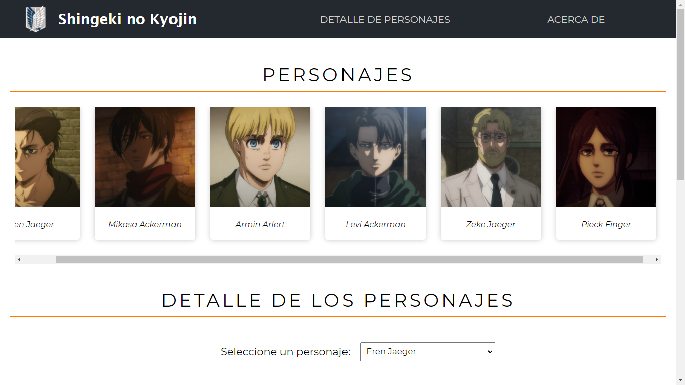
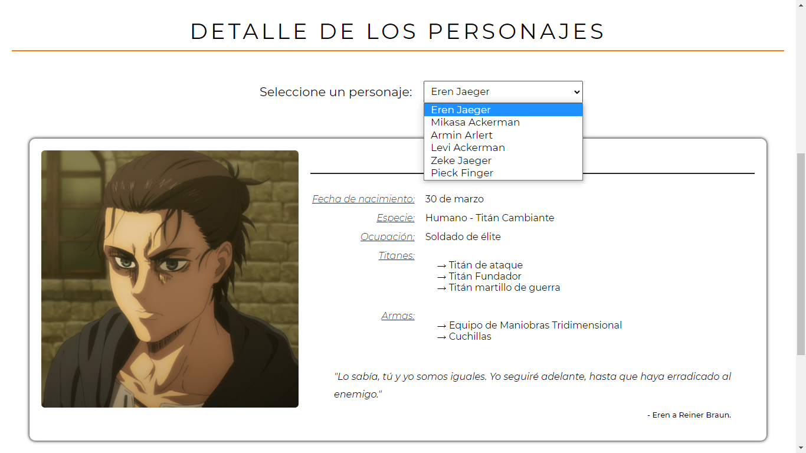
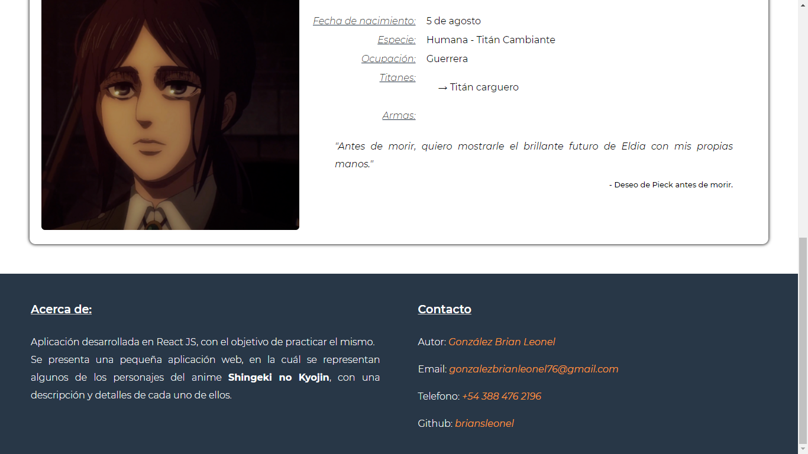

# Shingeki no kyojin

Aplicación desarrollada en React JS, con el objetivo de practicar el mismo.
Se presenta una pequeña aplicación web, en la cuál se representan algunos de los personajes del anime Shingeki no Kyojin, con una descripción y detalles de cada uno de ellos.

## Comenzando 🚀

_Estas instrucciones te permitirán obtener una copia del proyecto en funcionamiento en tu máquina local para propósitos de desarrollo y pruebas._

### Instalación 🔧

_Primeramente deberás clonar el repositorio de Github, con el siguiente comando:_
```
git clone https://github.com/briansleonel/shingeki-no-kyojin.git
```

_Luego tendrás que instalar las dependencias necesarias para el proyecto, ingresando lo siguiente:_
```
npm install
```

### Ejecutando el proyecto ⚙️

_Ahora tendrás que ejecutar el proyecto, con el suiguiente comando_
```
npm start
```
_Esto lo que hará es iniciar la aplicación en el puerto (http://localhost:3000), así poder visualizar el mismo.

## Construido con 🛠️

* [React JS](https://reactjs.org/) - El framework web usado

## Autor ✒️

* **González, Brian Leonel** - *Desarrollo del proyecto* - [briansleonel](https://github.com/briansleonel)

## Demo

Algunas capturas del proyecto:





